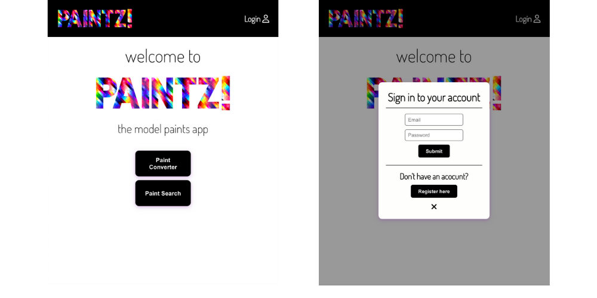
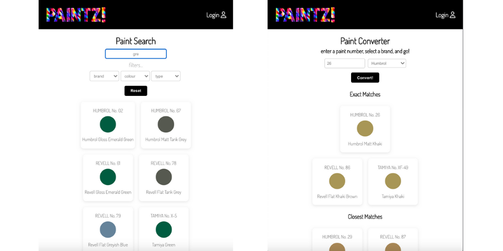

# Paintz!

This is Paintz! The model paint app; a relational database holding information on model paints, for key UK brands (currently Humbrol, Revell & Tamiya).

## Tech Stack
- Java
- Spring
- PostgreSQL
- React
- JavaScript
- npm libraries

## Running Instructions

### Server
- open all server files
- run 'PaintzServerApplication' (main method)
- runs on port localhost:8080

### Client
In Terminal run:
- `npm install`
- `npm start`
- runs on port localhost:3000

## Product Roadmap

### Completed Functionality

1. Intelligent search functionality:
    - be able to search by:
        - Paint brand 
        - Paint number - full or partial (if partial, bring up suggestions for ‘did you mean…’)
        - Paint name - full or partial
    - bringing up results for:
        - Exact matches - and the exact equivalents across all brands
        - Closest/alternative matches	
2. An easy-to-navigate GUI - simple layout and styling in a mobile-first design (but responsive for PCs), using React Styled Components.

Part of the original plan was to include User Accounts and the ability for users to save paints to their own personal inventory. In order to achieve this, Spring Security was configured in the server; however, due to the specific way in which Spring Security handles CORS, the frontend is currently unable to connect to the backend. All of the work around Spring Security is currently sitting in the feature/spring_security branch.

### Future Developments

1. User accounts - to be setup once Spring Security issues have been resolved
2. User inventory - user can save paints/stock level to their own personal inventory (only available to logged-in users)
3. Local suppliers - basic list, or developed into a search functionality displaying results by distance
4. Model selector - brings up all paints required and cross-references against user inventory
5. Shopping list - which could be ‘transferred’ to linked local supplier website/shopping basket
Administrator accounts - for amending database, and basic GUI
6. Barcode scanner - scan model barcodes to then bring up required paints (when using on mobile)
7. API endpoints to connect to local supplier websites

